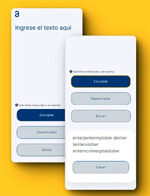

<!-- PROJECT LOGO -->
 

    

  <h3 align="center">Encriptador de texto</h3>

  

    Challenge ONE | Encriptador de texto
     
    <a href="https://github.com/othneildrew/Best-README-Template"><strong>Ver demo »</strong></a>
     
  

<!-- ABOUT THE PROJECT -->

## Acerca del proyecto

[![Vista desktop][product-screenshot-desktop]](https://example.com)

Este enciptador de texto es una actividad recomendada de realizar por el programe G6 ONE. La idea es poner en práctica lo aprendido con este challenge.

### Requisitos para la construcción del encriptador

#### Las "llaves" de encriptación son las siguientes:

- La letra "e" es convertida para "enter"
- La letra "i" es convertida para "imes"
- La letra "a" es convertida para "ai"
- La letra "o" es convertida para "ober"
- La letra "u" es convertida para "ufat"

#### Condiciones para el comportamiento

- Debe funcionar solo con letras minúsculas
- No deben ser utilizados letras con acentos ni caracteres especiales
- Debe ser posible convertir una palabra para la versión encriptada también devolver una palabra encriptada para su versión original.

Por ejemplo:

  
"gato" => "gaitober"

  
"gaitober" => "gato"

- La página debe tener campos para inserción del texto que será encriptado o desencriptado, y el usuario debe poder
- El resultado debe ser mostrado en la pantalla.

#### Extras

- Un botón que copie el texto encriptado/desencriptado para la sección de transferencia, o sea que tenga la misma funcionalidad del ctrl+C o de la opción "copiar" del menú de las aplicaciones.

Otra de las características del challenge es que la aplicación que fuese responsiva.

### Algunos conceptos aplicados

- Separación de responsabilidades del principio SOLID
- Programación funcional enfocándose en construir funciones puras

### Desarrollo

La intención del challenge es aprender a usar los leguajes y recursos bases de la plataforma web tales como los son:

- [![JavaScript][JavaScript]][JavaScript-url]
- [![HTML5][HTML5]][HTML5-url]
- [![CSS3][CSS3]][CSS3-url]

<!-- LICENSE -->

## Licencia

Distribuido bajo licencia GPL. Ver `LICENSE.txt` para más información.

(<a href="#encabezado">back to top</a>)

<!-- MARKDOWN LINKS & IMAGES -->

[JavaScript]: https://img.shields.io/badge/javascript-grey?logo=javascript
[JavaScript-url]: https://developer.mozilla.org/es/docs/Web/JavaScript
[HTML5]: https://img.shields.io/badge/html5-blue?logo=html5
[HTML5-url]: https://developer.mozilla.org/es/docs/Glossary/HTML5
[CSS3]: https://img.shields.io/badge/css3-orange?logo=css3
[CSS3-url]: https://developer.mozilla.org/es/docs/Web/CSS
[product-screenshot-desktop]: /assets/shots_so.webp
